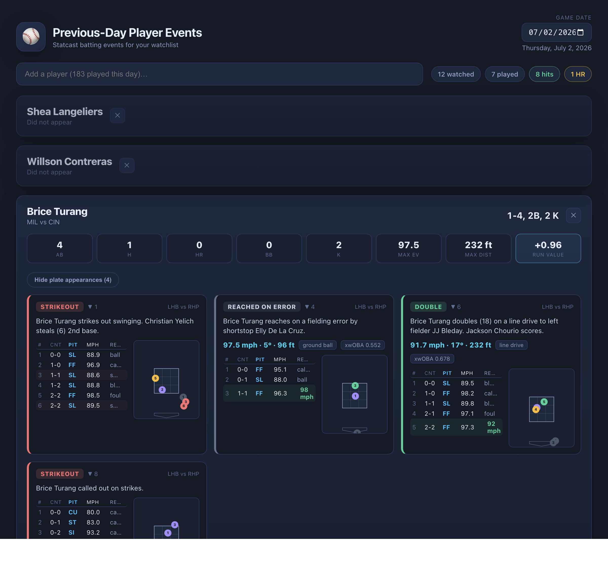
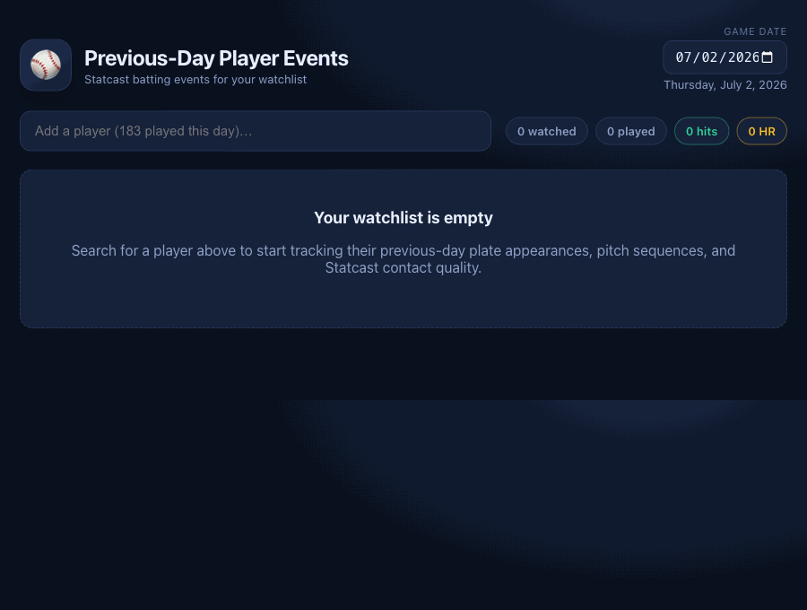
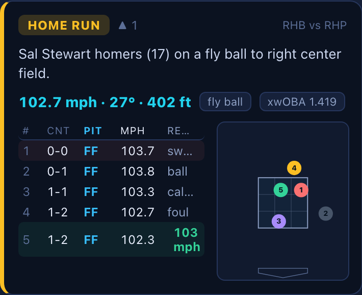
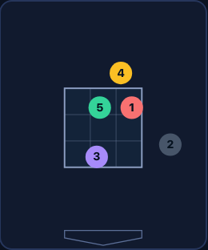
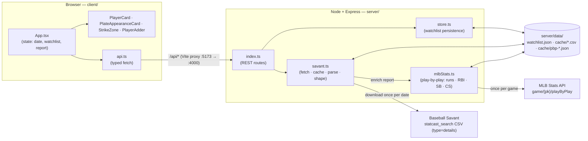
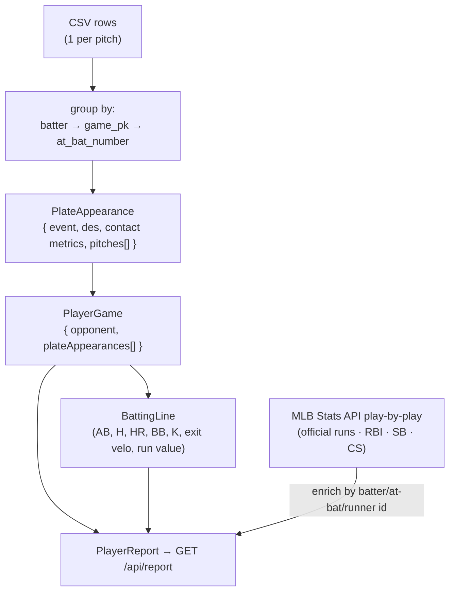

# Previous-Day Player Events

A full-stack TypeScript app for visualizing **previous-day MLB batting events** for a
watchlist of players, powered by Baseball Savant / Statcast pitch-level data, with
official scoring (runs, RBI, SB, CS) from the MLB Stats API.



Add players to your watchlist and instantly see, for any game date:

- Each player's **box-score line** (`2-4, HR, 3 RBI, SB, BB`) and a **big-day highlight** glow
- **Official scoring** stats — runs, RBI, stolen bases, and caught stealing — from the MLB Stats API
- **Every plate appearance** as a card: outcome, play description, pitcher/batter handedness
- The **pitch sequence** (type, velocity, count, result) with exit velocity on contact
- A **strike-zone plot** of every pitch, color-coded by result
- **Watch the play** — for any ball in play, the Statcast video embeds inline on demand
- **Statcast quality-of-contact** stats: exit velo, max distance, run value, xwOBA
- A link out to each player's Baseball Savant page

### Adding a player

Search your day's roster and add a player in one click — their events load
instantly.



### Anatomy of a plate appearance

Each plate appearance is a single card: a color-coded outcome badge, the play
description, the batted-ball line (exit velo · launch angle · distance + xwOBA),
the full pitch sequence, and a strike-zone plot where every pitch is a numbered
dot colored by result (in-play, whiff, foul, called strike, ball).

<table>
  <tr>
    <td width="62%"></td>
    <td width="38%"></td>
  </tr>
  <tr>
    <td align="center"><em>One plate appearance — outcome, contact metrics, pitch table</em></td>
    <td align="center"><em>Strike-zone plot (numbered, color-coded pitches)</em></td>
  </tr>
</table>

## Stack

| Layer    | Tech                                                          |
| -------- | ------------------------------------------------------------- |
| Frontend | React 19 + Vite 5 + TypeScript 6                              |
| Backend  | Node + Express 5 + TypeScript 6 (`tsx`)                       |
| Data     | Baseball Savant CSV + MLB Stats API (cached per date / game) |

The backend proxies and caches the Savant `type=details` CSV export (one row per
pitch), groups pitches into plate appearances and games, and computes batting
lines. On each report it also fetches the **MLB Stats API play-by-play** for the
games involved to layer in official scoring — runs, RBI (per PA and total),
stolen bases, and caught stealing — then serves the merged result to the client.
The player watchlist is persisted to `server/data/watchlist.json`.

## Architecture

### Request flow

A React client talks to an Express API over a small typed `fetch` layer. In dev,
Vite proxies `/api` to the backend; the backend fetches (and caches) the Savant
CSV, reshapes it, and returns typed JSON.



### Data transformation

The Savant export is flat — **one row per pitch**. `savant.ts` groups those rows
into the nested model (`types.ts`) that the UI renders, and derives each player's
batting line along the way.



### Module map

```
previous-day-player-events/
├─ package.json            workspaces + dev/build/start scripts
├─ server/                 Express API (TypeScript, ESM)
│  ├─ src/
│  │  ├─ index.ts          routes, error wrapping, static client in prod
│  │  ├─ savant.ts         Savant URL, download+cache, CSV → nested model
│  │  ├─ mlbStats.ts       Stats API play-by-play → runs · RBI · SB · CS · video (cached)
│  │  ├─ store.ts          watchlist read/write (watchlist.json)
│  │  └─ types.ts          shared data model
│  └─ data/                watchlist.json + cache/ (gitignored)
└─ client/                 React + Vite app
   ├─ vite.config.ts       dev server + /api proxy to 127.0.0.1:4000
   └─ src/
      ├─ App.tsx           top-level state + data fetching
      ├─ api.ts            typed API client
      ├─ lib.ts            display helpers (labels, colors, formatting)
      ├─ types.ts          model types (mirror of server)
      └─ components/
         ├─ PlayerAdder.tsx           roster search + autocomplete
         ├─ PlayerCard.tsx            per-player panel + stat pills
         ├─ PlateAppearanceCard.tsx   one PA: outcome, pitch table
         └─ StrikeZone.tsx            SVG pitch-location plot
```

## Getting started

```bash
npm install        # installs root + workspaces
npm run dev         # starts API (:4000) and client (:5173) together
```

Open http://localhost:5173. The client dev server proxies `/api` to the backend.

### Production build

```bash
npm run build       # builds client, compiles server
npm start           # serves API + built client on :4000
```

## API

| Method   | Route                  | Purpose                                     |
| -------- | ---------------------- | ------------------------------------------- |
| `GET`    | `/api/roster?date=`    | All batters who played that date (search)   |
| `GET`    | `/api/watchlist`       | Saved watchlist                             |
| `POST`   | `/api/watchlist`       | Add `{ id, savantName, name }`              |
| `DELETE` | `/api/watchlist/:id`   | Remove a player                             |
| `GET`    | `/api/report?date=`    | Watchlisted players' events for the date    |
| `GET`    | `/api/video/:playId`   | Resolve a play's Statcast `.mp4` URL        |

`date` defaults to the previous calendar day (`YYYY-MM-DD`).

## Notes

- Data is seeded for reasonable dates within the 2026 season (`hfSea=2026`).
- Cached data lives in `server/data/cache/` (gitignored): `{date}.csv` (Statcast)
  and `pbp-{gamePk}.json` (play-by-play). Delete to force a refresh.
- **Runs, RBI, SB, and CS** come from the MLB Stats API play-by-play
  (`/api/v1/game/{gamePk}/playByPlay`), which carries MLB's own official scoring —
  so no heuristics: RBI is `result.rbi` per at-bat, runs are runner movements
  ending at `score`, and steals/caught-stealing are counted from runner movements
  (`stolen_base_*` / `caught_stealing_*`), correctly ignoring defensive
  indifference and pickoffs. At-bats are joined to the Statcast rows by
  `at_bat_number == atBatIndex + 1`; players by MLB id.
- The Stats API is intended for non-commercial/personal use and publishes no rate
  limits, so play-by-play is fetched at most once per game and cached to disk.
- **Play video** uses the in-play pitch's `playId` (also from the play-by-play).
  `/api/video/:playId` scrapes the Savant `sporty-videos` page for the direct
  `sporty-clips.mlb.com/*.mp4` URL (resolved lazily, only when a clip is opened,
  and cached). The clip is hotlink-protected by User-Agent, which a real browser
  `<video>` satisfies — so it streams directly with no byte-proxying.
