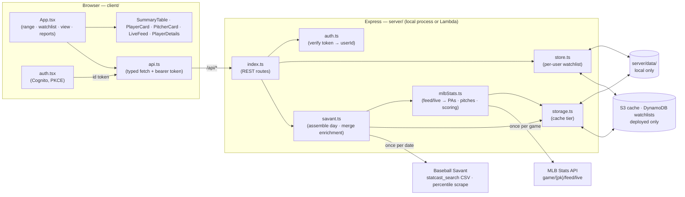
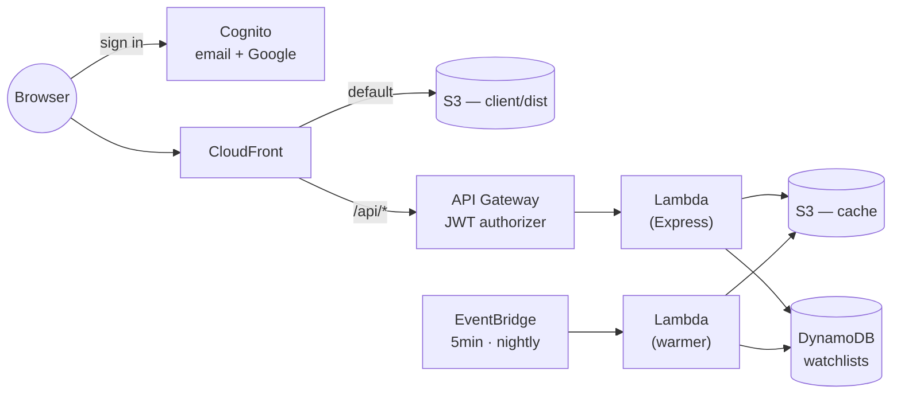
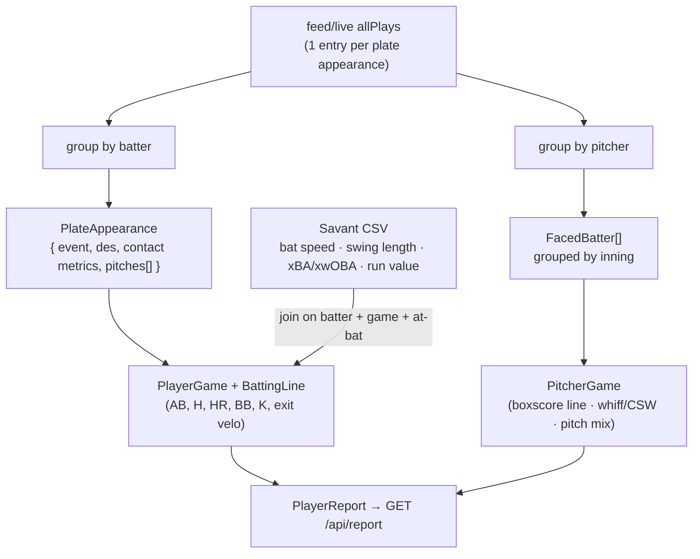

# Statcast Sicko

A full-stack TypeScript app for visualizing **MLB batting and pitching events**
over any date range, for a personal watchlist of players — built on MLB Stats API
play-by-play, enriched with Baseball Savant / Statcast pitch-level data.

Sign in, add players, and see for any date range:

- Each batter's **box-score line** (`2-4, HR, 3 RBI, SB, BB`) and a **big-day highlight** glow
- Each pitcher's **outing** — the full line (IP, H, R/ER, BB, K, decision), batters faced grouped by inning, and a Savant-style **arsenal table** with velo/spin/break vs his own season
- **Official scoring** — runs, RBI, stolen bases, caught stealing — from the MLB Stats API
- **Every plate appearance** as a card: outcome, play description, pitcher/batter handedness
- The **pitch sequence** (type, velocity, count, result) with exit velocity on contact
- A **strike-zone plot** of every pitch, color-coded by result
- **Watch the play** — the Statcast clip plays inline, plus a per-game highlight reel
- **Statcast quality-of-contact** stats: exit velo, max distance, run value, xwOBA
- **Percentile cards, rolling xwOBA charts, and platoon splits** in a per-player details view
- **Live games** update in place — scores, bases, and the current at-bat

### Three views

Toggled by tabs, and persisted in the URL so a reload or shared link restores the
same thing. Each shows one kind at a time (batters / pitchers), except the feed.

- **Summary** (default) — one stat row per player over the range, with a pinned total
- **Players** — one card per player, expandable down to individual pitches
- **Feed** — a chronological stream of completed plate appearances, base events, and upcoming games

### Anatomy of a plate appearance

Each plate appearance is a single card: a color-coded outcome badge, the play
description, the batted-ball line (exit velo · launch angle · distance + xwOBA),
the full pitch sequence, and a strike-zone plot where every pitch is a numbered
dot colored by result (in-play, whiff, foul, called strike, ball).

## Stack

| Layer    | Tech                                                           |
| -------- | -------------------------------------------------------------- |
| Frontend | React 19 + Vite 8 + TypeScript 6                               |
| Backend  | Node 22 + Express 5 + TypeScript 6 (ESM, `tsx` in dev)         |
| Data     | MLB Stats API (primary) + Baseball Savant CSV (enrichment)     |
| Infra    | AWS CDK — Lambda · API Gateway · S3 · CloudFront · DynamoDB · Cognito |

**The MLB Stats API is the primary source.** `mlbStats.ts` pulls each game's
`feed/live` play-by-play and builds the whole nested model — plate appearances,
pitches, official scoring, and hit data (exit velo, launch angle, distance).
Baseball Savant is **enrichment only**: it supplies the handful of Statcast
fields with no Stats API equivalent — bat speed, swing length, xBA/xwOBA, and
per-PA run value. If the Savant fetch fails the report still renders; those
fields are just null.

Watchlists are per user, keyed by Cognito `sub`. Running locally there is no
sign-in and one implicit dev user.

## Architecture

### Request flow

A React client talks to an Express API over a small typed `fetch` layer. The same
Express app runs as a local server in dev and as a Lambda in production — only
where it reads and writes changes.



### Deployed topology



`/api/*` is a CloudFront behavior over the same distribution, so the client stays
same-origin — no CORS anywhere, and `api.ts` keeps relative URLs.

### Data transformation

A game's `feed/live` play-by-play is a flat list of plays, each with its pitches.
`mlbStats.ts` walks that list **twice over the same plays** — once grouped by
batter, once by pitcher — so the two models come from one pass of the same
source. `savant.ts` then merges the Savant CSV in, keyed by
`batterId|gamePk|atBatNumber`.



Join keys: Stats API at-bats ↔ Savant rows on `at_bat_number == atBatIndex + 1`;
players by MLB id, falling back to a `Last, First` name match.

### Module map

```
baseball-sicko-stats/
├─ package.json            three workspaces + dev/build/deploy scripts
├─ server/                 Express API (TypeScript, ESM)
│  ├─ src/
│  │  ├─ index.ts          routes, error wrapping, compression, local static serving
│  │  ├─ lambda.ts         Lambda entry (serverless-http wrapper)
│  │  ├─ warmer.ts         scheduled cache warmer (live + backfill modes)
│  │  ├─ auth.ts           verify Cognito token → req.userId (dev user when off)
│  │  ├─ storage.ts        the cache tier — filesystem or S3, same keys
│  │  ├─ store.ts          per-user watchlist (watchlist.json or DynamoDB)
│  │  ├─ mlbStats.ts       feed/live → PAs · pitches · scoring · pitching lines · video
│  │  ├─ savant.ts         assemble the day, merge CSV enrichment, build reports
│  │  ├─ percentiles.ts    Savant percentile-card scrape (batter + pitcher tables)
│  │  ├─ pitcherArsenal.ts season arsenal: usage, velo/spin/break, results per pitch
│  │  ├─ pitchLeague.ts    curated league-average pitch table
│  │  ├─ xwoba.ts          season per-PA xwOBA sequence (for/against)
│  │  ├─ limit.ts          bounded concurrency for the report fan-out
│  │  ├─ names.ts          "First Last" → "Last, First"
│  │  └─ types.ts          shared data model
│  └─ data/                local only: watchlist.json + cache/ (gitignored)
├─ client/                 React + Vite app
│  ├─ vite.config.ts       dev server + /api proxy to 127.0.0.1:4000
│  └─ src/
│     ├─ App.tsx           top-level state, URL sync, live polling
│     ├─ auth.tsx          Cognito provider + sign-in gate (no-op when unconfigured)
│     ├─ api.ts            typed API client + bearer token + 401 retry
│     ├─ simulate.ts       synthetic live day (?sim=1) for demoing live UI
│     ├─ hooks.ts          scroll-into-view on expand
│     ├─ lib.ts            display helpers (labels, colors, formatting)
│     ├─ types.ts          model types (mirror of server)
│     └─ components/
│        ├─ SummaryTable.tsx        full-range stat table (default view)
│        ├─ LiveFeed.tsx            chronological plays + base events + upcoming
│        ├─ PlayerCard.tsx          batter panel + stat pills
│        ├─ PitcherCard.tsx         Line · Innings · Arsenal sections
│        ├─ PlateAppearanceCard.tsx one PA: outcome, pitch table, clip
│        ├─ PitchSequence.tsx       shared pitch table + strike-zone plot
│        ├─ Arsenal.tsx             arsenal rows, rate bars, split tabs
│        ├─ PlayerDetails.tsx       percentiles · rolling xwOBA · arsenal · splits
│        ├─ RollingXwoba.tsx        client-computed rolling xwOBA chart
│        ├─ PlayerAdder.tsx         roster search + autocomplete
│        ├─ PlayerOrderEditor.tsx   drag-to-reorder + remove
│        ├─ GameReel.tsx            back-to-back highlight reel
│        ├─ BaseDiamond.tsx         runners on base
│        ├─ DateRangePicker.tsx     range picker + presets
│        └─ StrikeZone.tsx          SVG pitch-location plot
└─ infra/                  AWS CDK app
   ├─ bin/app.ts           context-driven entry (siteUrl, cognitoPrefix, google…)
   ├─ lib/stack.ts         the whole stack
   └─ cdk.json             pinned deployment context
```

## Getting started

```bash
npm install        # installs root + workspaces
npm run dev         # starts API (:4000) and client (:5173) together
```

Open http://localhost:5173. The client dev server proxies `/api` to the backend.
There is **no sign-in locally** — with no Cognito configured the client skips
auth and every request belongs to one implicit dev user, whose watchlist is
`server/data/watchlist.json`.

### Production build

```bash
npm run build       # builds client, compiles server
npm start           # serves API + built client on :4000
```

## Deploying to AWS

The `infra/` workspace is a CDK app that puts the client on S3 + CloudFront, the
API on Lambda behind API Gateway, the cache in S3, and per-user watchlists in
DynamoDB, with Cognito for sign-in.

Everything is selected by environment variable, so **local development is
unchanged** — with no AWS variables set the server writes to `server/data/` and
treats every request as one dev user, exactly as before.

### One-time setup

1. **Bootstrap CDK** in the target account/region (once ever):
   ```bash
   npm run cdk -- bootstrap
   ```
2. **Google sign-in** (optional — omit `googleClientId` from `infra/cdk.json` to
   launch with email/password only). Create a **Web application** OAuth client in
   the Google Cloud console, whose authorized redirect URI is
   `https://<cognitoPrefix>.auth.<region>.amazoncognito.com/oauth2/idpresponse`
   (the stack also prints this as its `GoogleRedirectUri` output; no JavaScript
   origins are needed, since Cognito exchanges the code server-side). Publish the
   consent screen — while it's in *Testing* only listed test users can sign in at
   all. `openid`/`email`/`profile` are non-sensitive, so publishing needs no
   Google review.

   Then store the client **secret** — as **plaintext**, not key/value JSON, since
   CDK reads the whole `SecretString`:
   ```bash
   aws secretsmanager create-secret --name baseball-sicko/google-oauth \
     --secret-string 'YOUR_GOOGLE_CLIENT_SECRET'
   ```

### Deploy

```bash
npm run deploy -- --require-approval never    # build client + server, then cdk deploy
```

Then register the site's own URL as a Cognito callback:

```bash
npm run cdk -- deploy --require-approval never -c siteUrl=https://dXXXXXXXX.cloudfront.net
```

**Why two passes.** Cognito's callback URL needs the CloudFront domain; the
distribution needs the API as an origin; the API needs the JWT authorizer; the
authorizer needs the user pool client — a dependency cycle. Passing the site URL
in as context breaks it. The first deploy prints the exact second command as its
`NextStep` output. This collapses to a single pass behind a custom domain, where
the URL is known up front.

Deployment settings live in `infra/cdk.json` context (`cognitoPrefix`,
`googleClientId`, `googleSecretName`) so a bare `cdk deploy` produces the right
stack — context isn't carried between runs, so anything passed only as `-c` on
the first pass would silently vanish on the second. `-c region=` and
`-c siteUrl=` can still be passed per-invocation.

### How the pieces map

| Concern      | Local                 | Deployed                                   |
| ------------ | --------------------- | ------------------------------------------ |
| Cache        | `server/data/cache/`  | S3, `cache/` prefix (`CACHE_BUCKET`)       |
| Watchlist    | `watchlist.json`      | DynamoDB, one item per user (`WATCHLIST_TABLE`) |
| User         | `local`               | Cognito `sub` (`USER_POOL_ID`)             |
| Static files | `express.static`      | S3 + CloudFront                            |

`/api/*` is a CloudFront behavior pointing at API Gateway, so the client stays
same-origin and there is no CORS anywhere.

### Keeping the cache warm

A cold `/api/report` over a wide date range would blow API Gateway's 30s limit —
it fans out to a feed and win-probability blob per game plus a multi-MB Savant
CSV per day. Two EventBridge rules keep that off the interactive path: one every
5 minutes for today and yesterday, and a nightly backfill that snapshots each
finished day as a single gzipped object and refreshes per-player season data.

A genuinely cold request for an old, wide range can still time out. If that
becomes a real problem the escape hatch is a streaming Lambda Function URL for
`/api/report` alone as a second CloudFront origin.

## API

Every route requires a bearer token except `/api/health` and `/api/config`.
Running locally there is no user pool, so auth is skipped entirely.

| Method   | Route                                | Purpose                                        |
| -------- | ------------------------------------ | ---------------------------------------------- |
| `GET`    | `/api/health`                        | Liveness — public                              |
| `GET`    | `/api/config`                        | Cognito settings for the client — public       |
| `GET`    | `/api/players`                       | Season roster, for the add-player search       |
| `GET`    | `/api/watchlist`                     | The signed-in user's watchlist                 |
| `POST`   | `/api/watchlist`                     | Add `{ id, savantName, name, kind }`           |
| `PUT`    | `/api/watchlist/order`               | Persist a new order, by player **keys**        |
| `DELETE` | `/api/watchlist/:id?kind=`           | Remove; without `kind`, every entry for the id |
| `GET`    | `/api/report?start=&end=`            | Watchlisted players' events over the range     |
| `GET`    | `/api/percentiles/:id?type=`         | Savant percentile card                         |
| `GET`    | `/api/players/:id/splits?type=`      | Season platoon splits                          |
| `GET`    | `/api/players/:id/xwoba?type=`       | Per-PA xwOBA sequence (for / against)          |
| `GET`    | `/api/players/:id/arsenal`           | A pitcher's season arsenal + league baselines  |
| `GET`    | `/api/video/:playId?gamePk=`         | Resolve a play's Statcast `.mp4` URL           |

`start`/`end` default to the previous calendar day in **US Eastern** (games end
after midnight ET), and the span is capped at 62 days. A watchlist entry is
identified by `${kind}-${id}`, not the MLB id — a two-way player is two entries.

## Notes

- The season is pinned to 2026 in **four** places that must stay in sync:
  `hfSea` in `savant.ts`, `CURRENT_SEASON` in `percentiles.ts`, and `SEASON` in
  both `xwoba.ts` and `pitcherArsenal.ts`.
- Cached data lives in `server/data/cache/` locally, or S3 when deployed —
  `{date}.csv` (Statcast), `game-{gamePk}-v{N}.json` (feed), `wp-*`/`content-*`,
  and `day-{date}-v{N}.json.gz` (a whole finished day, one gzipped object).
  Delete to force a refresh.
- **Runs, RBI, SB, and CS** come from the MLB Stats API `feed/live` play-by-play,
  which carries MLB's own official scoring — so no heuristics: RBI is
  `result.rbi` per at-bat, runs are runner movements ending at `score`, and
  steals/caught-stealing are counted from runner movements (`stolen_base_*` /
  `caught_stealing_*`), correctly ignoring defensive indifference and pickoffs.
  A pitcher's runs are charged via `responsiblePitcher`, so a reliever isn't
  billed for inherited runners.
- The Stats API is intended for non-commercial/personal use and publishes no rate
  limits, so each game is fetched at most once and cached, and the report's
  fan-out is explicitly concurrency-capped.
- **Live games** re-fetch via `diffPatch` deltas at most once every 10s; the
  client re-polls `/api/report` every 20s while any game is in progress. Finished
  days are frozen and snapshotted.
- **Play video** uses the in-play pitch's `playId`. `/api/video/:playId` scrapes
  the Savant `sporty-videos` page for the direct `sporty-clips.mlb.com/*.mp4` URL
  (resolved lazily, only when a clip is opened, and cached). The clip is
  hotlink-protected by User-Agent, which a real browser `<video>` satisfies — so
  it streams directly with no byte-proxying, and hosting it behind CloudFront
  changes nothing about playback.
- There is **no test runner and no linter**. Verifying a change means running
  `npm run build` (typecheck) and exercising the flow in the running app —
  including *rendering* the client, since a build passes on a bundle that throws
  at runtime.
